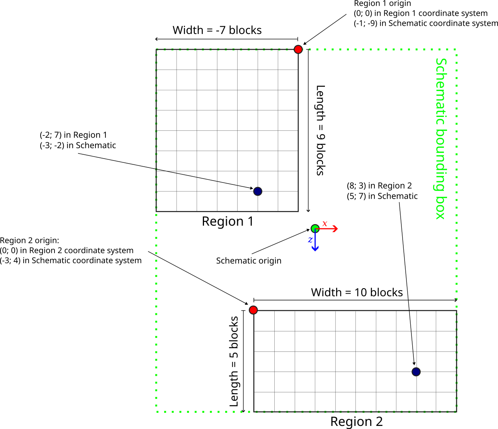

The Litematic file format
=========================

A Litematic file is made up of an NBT compound, and is basically just some metadata and a list of regions.
The Litematic version and `Minecraft data version <https://minecraft.fandom.com/wiki/Data_version>`_
are also stored at the root of the compound.
In Litemapy, a litematic schematic is represented by the :class:`~litemapy.Schematic` class.

Metadata
````````
A schematic stores the following metadata:

* A name for the schematic, that the user can set
* A description, also chosen by the user
* An author, which can be set to anything the user likes
* A preview image, which Litemapy does not fully support yet
* A creation timestamp, set automatically at the time the Schematic is created
* A modification timestamp, that Litemapy updates by default when saving a schematic
* The width, height and length of the enclosure of the schematic, that Litemapy computes automatically
* The total volume of that enclosure, also computed automatically
* The total count of non-air blocks in that enclosure, also computed automatically
* By default, Litemapy adds a `Software` entry on schematics it creates to distinguish them from Litematica's

Please refer to :doc:`the following page <schematic>` for a detailed description of the :class:`~litemapy.Schematic` class.

Regions
```````
Regions are where the actual important data is stored.
Each region is represented in Litemapy by a :class:`~litemapy.Region` object and has:

* A name, used to address it within the schematic
* A fixed position within the schematic
* A fixed width, height and length
* An internal array storing the block state at each position in the region's volume
* A list of entities within the region
* A list of tile entities within the region
* A list of pending blocks and fluid ticks, used to resume ticking when a schematic is pasted back into a world,
  and currently not fully supported by litemapy

Please refer to :doc:`the following page <region>` for a detailed description of the :class:`~litemapy.Region` class.

.. _coordinates:

Coordinate Systems
``````````````````
Each region has its own coordinate system relative to its origin,
and a position for that origin relative to the schematic's origin.
Furthermore, regions can have negative dimensions, meaning they will contain blocks in the [size + 1; 0] range
instead of the [0; size - 1] range, in their own coordinate system.
The following image gives an example of how coordinate systems work together:

